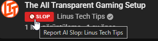
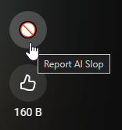
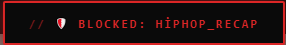
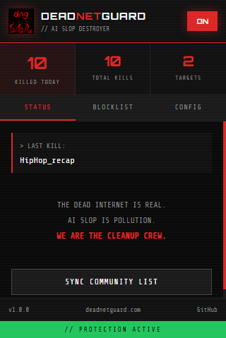
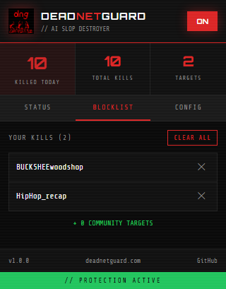
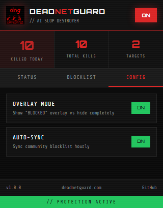

# DeadNetGuard

<p align="center">
  
</p>

<p align="center">
  <strong>The internet is dying. AI slop is killing it. We're fighting back.</strong>
</p>

<p align="center">
  DeadNetGuard is a Chrome extension that blocks AI-generated garbage content from your YouTube feed.<br>
  No more robot voices reading Reddit threads. No more AI-animated "history" channels. No more algorithmically-generated brain rot.
</p>

<p align="center">
  <a href="https://deadnetguard.com"></a>
  <a href="LICENSE"></a>
  <a href="https://deadnetguard.com"></a>
</p>

---

## What is AI Slop?

AI Slop refers to low-effort, AI-generated content designed to game YouTube's algorithm:

- 🤖 AI voiceovers reading Reddit posts
- 📺 Faceless channels churning out hundreds of videos daily
- 🎭 Stolen content with AI modifications
- 📚 Mass-produced "educational" content with no real expertise
- 🏛️ AI-animated "history" or "mystery" channels
- 🎮 Text-to-speech commentary over gameplay/stock footage

**The Dead Internet Theory isn't just a conspiracy anymore.** Bots creating content for bots, algorithms feeding algorithms, while real human creativity drowns.

---

## Screenshots

### Block Button on YouTube Homepage
One click to block any AI slop channel. The button appears next to the channel name.

<p align="center">
  
</p>

### Block Button on YouTube Shorts
Native-styled block button in the Shorts action bar. Blocked channels are auto-skipped.

<p align="center">
  
  &nbsp;&nbsp;&nbsp;
  
</p>

### Extension Popup

<p align="center">
  
  &nbsp;
  
  &nbsp;
  
</p>

**Status Tab** - View your kill count and sync community blocklist<br>
**Blocklist Tab** - Manage your personal blocked channels<br>
**Config Tab** - Toggle overlay mode and auto-sync settings

---

## Features

### 🎯 One-Click Blocking
Click the **BLOCK** button next to any channel name to instantly add it to your blocklist. No menus, no hassle.

### 📱 YouTube Shorts Support
Blocked channels on Shorts are **automatically skipped**. A native-styled block button appears in the action bar.

### 👥 Dual Blocklists
- **Personal Blocklist**: Channels you've blocked yourself, stored locally
- **Community Blocklist**: Crowdsourced database of known AI slop channels

### 🎨 Multiple Display Modes
- **Overlay Mode**: Shows a "BLOCKED" overlay on videos (click to reveal)
- **Hidden Mode**: Completely removes blocked content from your feed

### 🔒 Privacy First
- No tracking or analytics
- No account required
- Personal blocklist stored locally
- Only channel names sent when reporting

---

## Installation

### From Chrome Web Store
*Coming soon - currently in review*

### From Source (Developer Mode)

#### Prerequisites
- Node.js 18+
- npm or yarn

#### Build Extension
```bash
# Clone the repository
git clone https://github.com/Hikan-Teki/deadnetguard.git
cd deadnetguard

# Install dependencies and build
cd extension
npm install
npm run build
```

#### Load in Chrome
1. Open Chrome and go to `chrome://extensions`
2. Enable **Developer mode** (toggle in top-right)
3. Click **Load unpacked**
4. Select the `extension/dist` folder
5. The extension icon should appear in your toolbar

---

## Usage

### Blocking Channels

**On YouTube Home/Search/Recommendations:**
1. Hover over any video
2. Look for the red **BLOCK** button next to the channel name
3. Click to instantly block the channel

**On YouTube Shorts:**
1. Look for the 🚫 button in the action bar
2. Click to block and auto-skip to the next Short

### Managing Blocklist
1. Click the DeadNetGuard extension icon
2. Go to **BLOCKLIST** tab
3. View your blocked channels
4. Click ✕ to unblock any channel

---

## Tech Stack

### Extension
| Technology | Purpose |
|------------|---------|
| React 18 | UI Components |
| TypeScript | Type Safety |
| Vite | Build Tool |
| CRXJS | Chrome Extension Plugin |
| Zustand | State Management |

### Backend API
| Technology | Purpose |
|------------|---------|
| Node.js | Runtime |
| Express | Web Framework |
| PostgreSQL | Database |
| Prisma | ORM |

---

## Project Structure

```
deadnetguard/
├── extension/                 # Chrome Extension
│   ├── src/
│   │   ├── content/          # YouTube DOM manipulation
│   │   ├── background/       # Service worker
│   │   └── App.tsx           # Popup UI
│   └── dist/                 # Built extension
│
├── backend/                   # API Server
│   ├── src/routes/           # API endpoints
│   └── prisma/               # Database schema
│
├── website/                   # Landing page
│
└── assets/                    # Logos and screenshots
```

---

## API Endpoints

| Method | Endpoint | Description |
|--------|----------|-------------|
| GET | `/api/banlist` | Get community blocklist |
| GET | `/api/banlist/version` | Check for updates |
| GET | `/api/stats` | Public statistics |
| POST | `/api/report` | Report a channel |
| POST | `/api/vote` | Vote on reported channel |

---

## Self-Hosting

```bash
cd backend
npm install
cp .env.example .env
# Edit .env with your database credentials
npx prisma migrate deploy
npm run build
npm start
```

---

## Contributing

### Report AI Slop Channels
The easiest way to contribute - just use the extension and block channels.

### Code Contributions
1. Fork the repository
2. Create a feature branch
3. Commit your changes
4. Open a Pull Request

### Bug Reports
[Open an issue](https://github.com/Hikan-Teki/deadnetguard/issues) with browser version, steps to reproduce, and expected behavior.

---

## Privacy Policy

- **No Personal Data Collection**
- **No Browsing History Tracking**
- **Local Storage Only**
- **No Analytics**

---

## License

MIT License - see [LICENSE](LICENSE) for details.

---

## The Mission

> *"The Dead Internet Theory suggests that the internet has been almost entirely taken over by artificial intelligence. While that used to be a conspiracy theory, it's becoming more real every day."*

We're not anti-AI. We're anti-slop. AI can be a tool for creativity, but it's being weaponized to flood platforms with garbage content.

**This is just the beginning.** YouTube today. The entire internet tomorrow.

---

## Links

- 🌐 **Website**: [deadnetguard.com](https://deadnetguard.com)
- 💬 **Support**: [deadnetguard.com/support](https://deadnetguard.com/support.html)
- 🐛 **Issues**: [GitHub Issues](https://github.com/Hikan-Teki/deadnetguard/issues)
- 💡 **Discussions**: [GitHub Discussions](https://github.com/Hikan-Teki/deadnetguard/discussions)

---

<p align="center">
  <strong>Built with rage against the machine</strong><br>
  <sub>DeadNetGuard - Because someone has to clean up this mess</sub>
</p>
